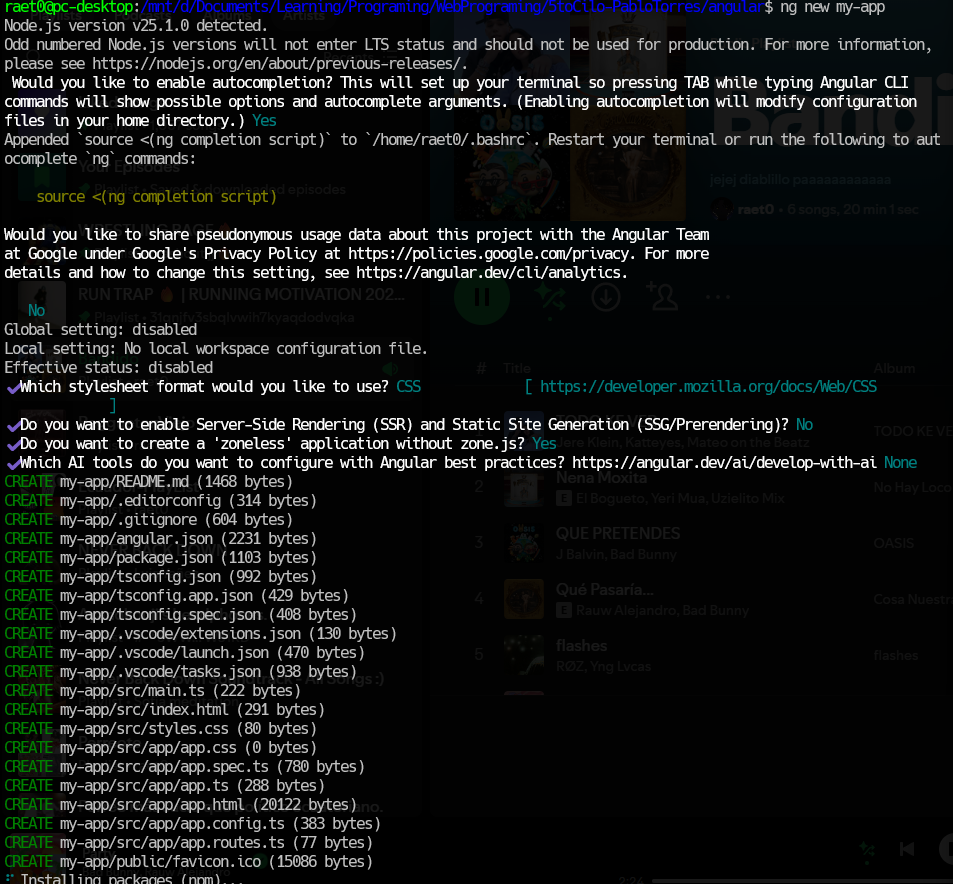
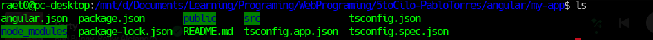
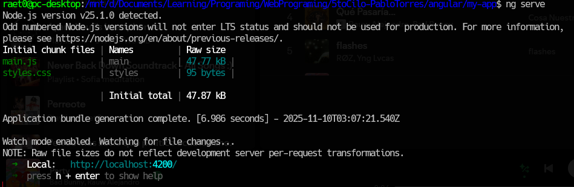
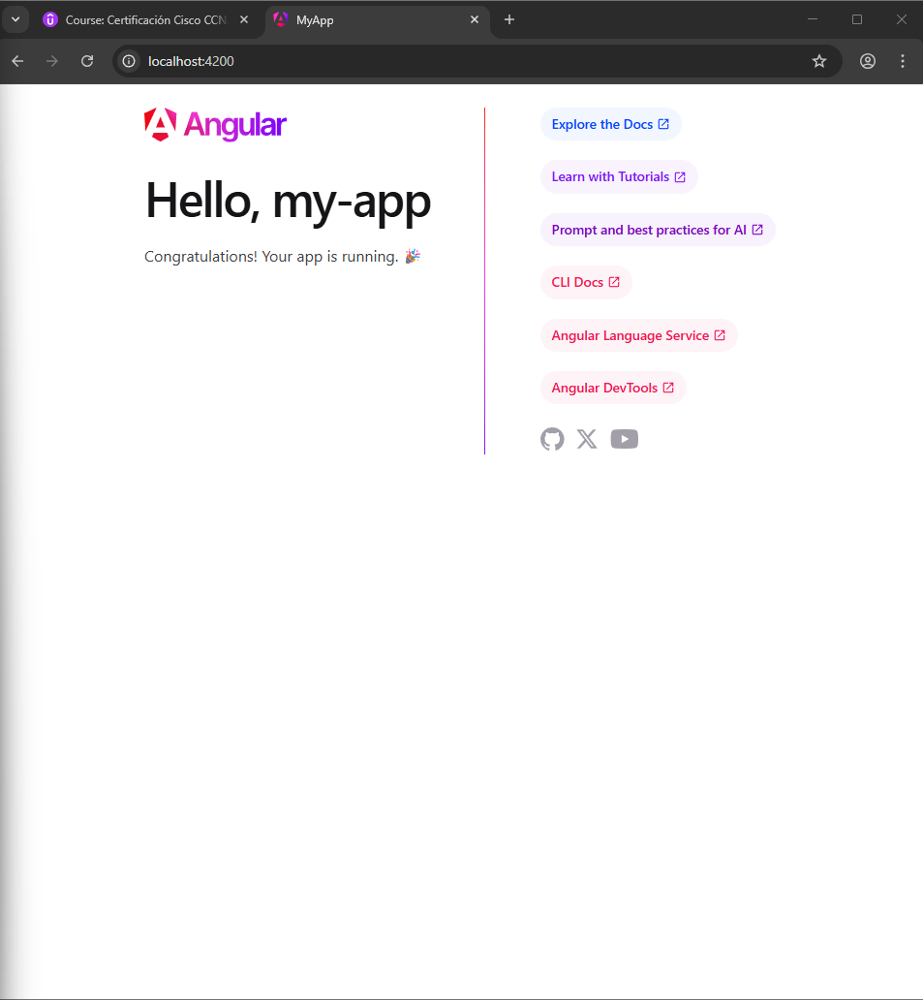
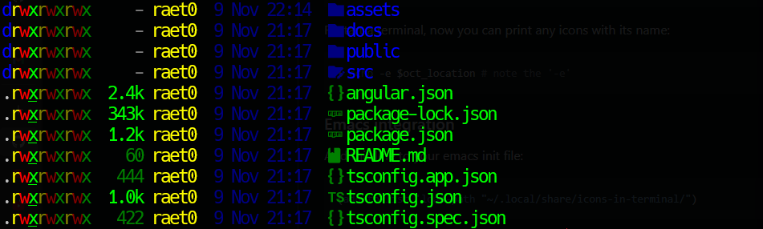

# Programación y Plataformas Web

# Frameworks Web: Angular

<div align="center">
  
</div>

## Practica 1: Instalación y Configuración de Angular

### Autores

**Rafael Prieto**
📧 pprietos@est.ups.edu.ec
💻 GitHub: [Raet0](https://github.com/Raet0)

### Instalación de Angular CLI

Antes de iniciar, es necesario verificar que tenemos **pnpm** instalado.
Para verificarlo:

'''bash
pnpm -v
'''

si dice que no existe el comando, instálalo ejecutando:

```bash
npm install -g pnpm
```
---

### Creación de un Proyecto en Angular 

Primero ubícate en la carpeta donde quieras trabajar y vamos a ejecutar el siguente comando:
```bash
pnpm install -g @angular/cli
```
Esto lo que hara es que verifica el angular en el sistema y nos devolvera un mensaje como este:
```bash
/home/raet0/.local/share/pnpm/global/5:
+ @angular/cli 20.3.9

Done in 8.9s using pnpm v10.21.0
```

Ahora vamos a crear un nuevo proyecto en angular con el siguentes comando:
```bash
ng new my-app
```
Esto desplegara al asistente y tendremo que leer cada uno y eligir segun nuestra preferencia.

<div align="center">
  
</div>

Una vez creado el repositorio no creara la carpeta con el nombre que de dimos una vez entramos podemos ver los siguentes archivos.

<div align="center">
  
</div>

Entonces para iniciar el  servidor podemos hacer lo siguentes, una vez dentro de la carpeta ingresamos el siguente comando.
```bash
ng serve
```
Esto iniciara el servidor por defecto en el puerto : 4200

Y la terminal se quedara corriendo el servidor de la siguente manera:

<div align="center">
  
</div>

Lo que podemos hacer ahora es ingresar a la pagina de angular que estas corriendo se ve asi:

<div align="center">
  
</div>

## Explicación de la estructura del proyecto:

<div align="center">
  
</div>

##### Carpetas y archivos principales:

- `assets`: Lo que podemos encontrar aqui son caprutas y informes. 
- `public`: Contiene archivos estáticos accesibles públicamente.
- `src`: Carpeta que contiene el código fuente de la aplicación.
- `node_modules`: Carpeta que contiene las dependencias del proyecto.
- `pnpm-lock.yaml`: Archivo de bloqueo de versiones para pnpm.
- `angular.json`: Archivo de configuración de Angular.
- `package.json`: Archivo de configuración de npm.
- `tsconfig.json`: Archivo de configuración de TypeScript.
- `tsconfig.app.json`: Archivo de configuración de TypeScript para la aplicación.
- `tsconfig.spec.json`: Archivo de configuración de TypeScript para las pruebas.

### Carpeta de código SRC

Dentro de la carpeta `src`, encontramos las siguientes subcarpetas y archivos importantes:

- `app`: Contiene el código principal de la aplicación, incluyendo componentes, servicios y módulos.
- `index.html`: Archivo HTML principal de la aplicación.
- `main.ts`: Punto de entrada de la aplicación.
- `styles.css`: Archivo de estilos globales.

### Carpeta APP

Dentro de la carpeta `app`, encontramos la siguiente estructura de archivos:

- `app.config.ts`: Archivo de configuración de la aplicación.
- `app.css`: Archivo de estilos específicos de la aplicación.
- `app.html`: Archivo HTML principal de la aplicación.
- `app.routes.ts`: Archivo de definición de rutas de la aplicación.
- `app.spec.ts`: Archivo de pruebas unitarias de la aplicación.
- `app.ts`: Archivo principal de la aplicación.
