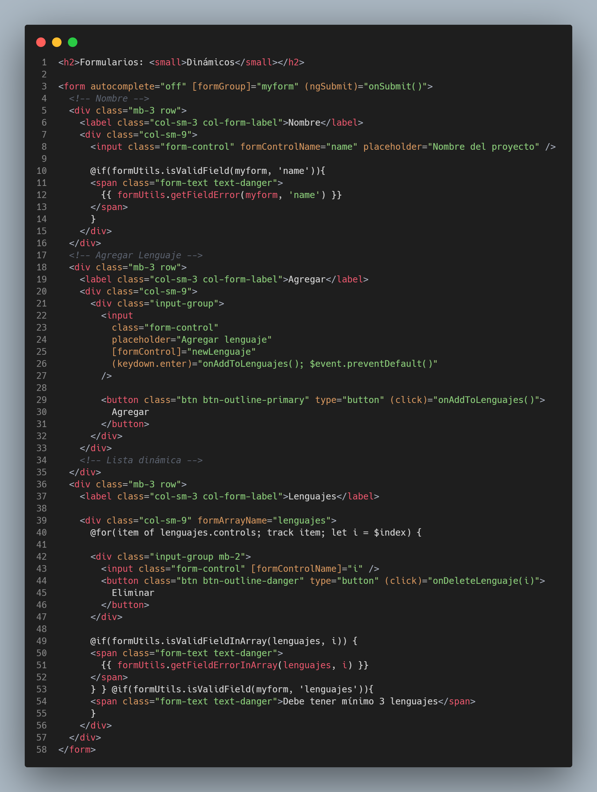
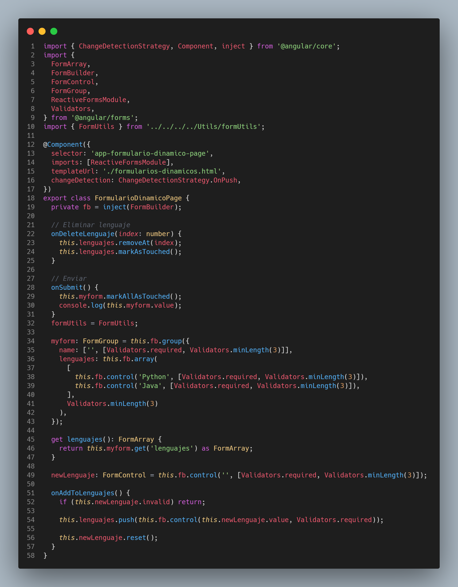
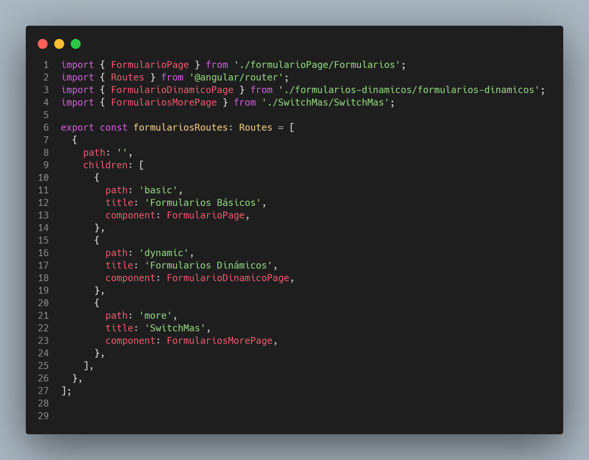
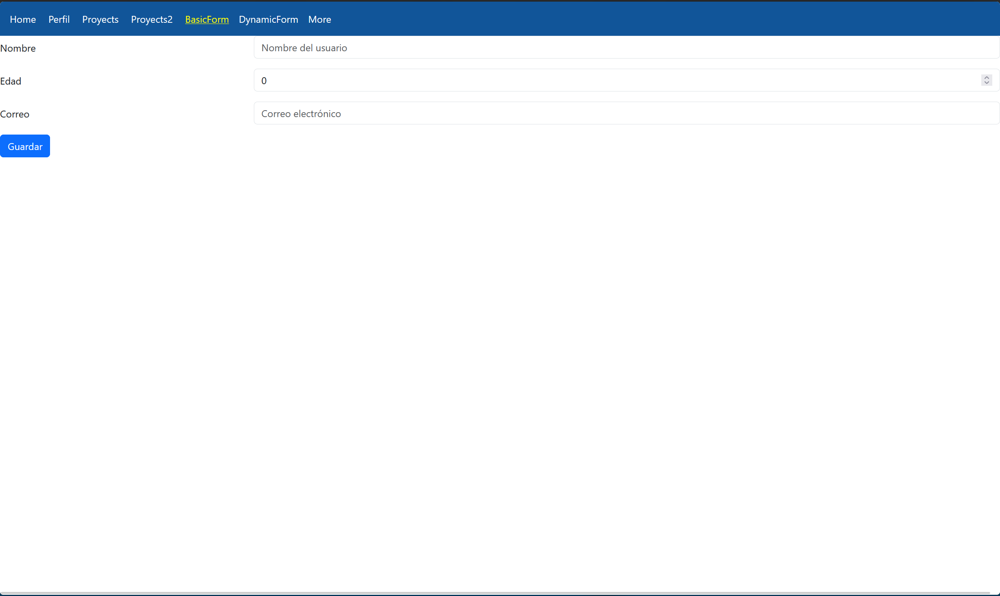
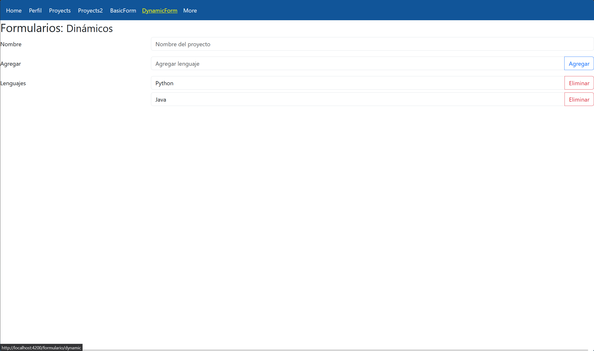
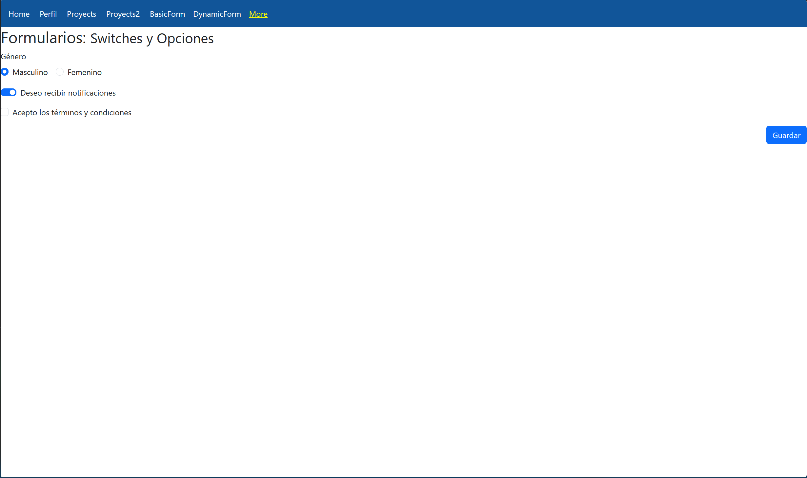

# Programación y Plataformas Web 

# Frameworks Web: Angular

<div align="center">
  
</div>

## Práctica 3: Navegación en Angular

### Autor

**Rafael Prieto**  
📧 pprietos@est.ups.edu.ec  
💻 GitHub: [raet0](https://github.com/raet0)

---

# Formularios Dinámicos en Angular

Este documento muestra el HTML y el TypeScript corregidos para un formulario dinámico con FormArray, incluyendo validaciones y métodos utilitarios.

---
# Introducción

En esta práctica se desarrolla un formulario dinámico utilizando Angular, Reactive Forms y la clase **FormArray**, permitiendo agregar y eliminar elementos de forma interactiva.

Este patrón es útil cuando no conocemos el número de entradas que agregará el usuario: lenguajes, teléfonos, tareas, hobbies, etc.

El objetivo principal es comprender:
- Cómo crear formularios dinámicos
- Cómo validar cada control y el FormArray completo
- Cómo centralizar mensajes de error mediante **FormUtils**

---

# Contenido del informe

1. Estructura del formulario dinámico  
2. Código HTML  
3. Código TypeScript del componente  
4. Rutas del módulo de formularios  
5. Capturas de la página desplegada  
6. FormUtils para validar FormArray  
7. Pruebas recomendadas  
8. Despliegue en GitHub Pages  
9. Conclusión  

---

# 1. Estructura del Formulario Dinámico

El formulario tiene:

- **Campo fijo:** `name`
- **Control independiente:** `newLenguaje`
- **FormArray:** `lenguajes`
- **Validaciones:**  
  - Por control  
  - Por FormArray (minLength)
- **Acciones:** agregar, eliminar, enviar
- **FormUtils:** maneja los mensajes de error


## ✅ HTML (`formularios-dinamicos.html`)

```html
<h2>Formularios: <small>Dinámicos</small></h2>

<form autocomplete="off" [formGroup]="myForm" (ngSubmit)="onSubmit()">

  <!-- Nombre -->
  <div class="mb-3 row">
    <label class="col-sm-3 col-form-label">Nombre</label>
    <div class="col-sm-9">
      <input class="form-control" formControlName="name" placeholder="Nombre del proyecto">

      @if(formUtils.isValidField(myForm, 'name')){
      <span class="form-text text-danger">
        {{ formUtils.getFieldError(myForm, 'name') }}
      </span>
      }
    </div>
  </div>

  <!-- Input para agregar lenguaje -->
  <div class="mb-3 row">
    <label class="col-sm-3 col-form-label">Agregar</label>
    <div class="col-sm-9">
      <div class="input-group">
        <input class="form-control"
               placeholder="Agregar lenguaje"
               [formControl]="newLenguaje"
               (keydown.enter)="onAddToLenguajes(); $event.preventDefault()">

        <button class="btn btn-outline-primary"
                type="button"
                (click)="onAddToLenguajes()">
          Agregar
        </button>
      </div>
    </div>
  </div>

  <!-- Lista Dinámica -->
  <div class="mb-3 row">
    <label class="col-sm-3 col-form-label">Lenguajes</label>

    <div class="col-sm-9" formArrayName="lenguajes">

      @for(item of lenguajes.controls; track item; let i = $index) {
        <div class="input-group mb-2">
          <input class="form-control" [formControlName]="i">
          <button class="btn btn-outline-danger" type="button" (click)="onDeleteLenguaje(i)">
            Eliminar
          </button>
        </div>

        @if(formUtils.isValidFieldInArray(lenguajes, i)) {
          <span class="form-text text-danger">
            {{ formUtils.getFieldErrorInArray(lenguajes, i) }}
          </span>
        }
      }

      @if(lenguajes.errors?.minlength && lenguajes.touched){
        <span class="form-text text-danger">Debe tener mínimo 3 lenguajes</span>
      }
    </div>
  </div>

</form>
```
# Codigo ts:

```ts
import { ChangeDetectionStrategy, Component, inject } from '@angular/core';
import {
  FormArray,
  FormBuilder,
  FormControl,
  FormGroup,
  Validators,
  ReactiveFormsModule,
} from '@angular/forms';
import { FormUtils } from '../../../../../Utils/formUtils';

@Component({
  selector: 'app-formularios-dinamicos',
  imports: [ReactiveFormsModule],
  templateUrl: './formularios-dinamicos.html',
  changeDetection: ChangeDetectionStrategy.OnPush,
})
export class FormulariosDinamicos {

  private fb = inject(FormBuilder);

  formUtils = FormUtils;

  newLenguaje: FormControl = this.fb.control('', [
    Validators.required,
    Validators.minLength(3)
  ]);

  myForm: FormGroup = this.fb.group({
    name: ['', [Validators.required, Validators.minLength(3)]],
    lenguajes: this.fb.array<FormControl>([], [
      Validators.minLength(3)
    ])
  });

  get lenguajes(): FormArray {
    return this.myForm.get('lenguajes') as FormArray;
  }

  onAddToLenguajes() {
    if (this.newLenguaje.invalid) return;

    this.lenguajes.push(
      this.fb.control(this.newLenguaje.value, [
        Validators.required,
        Validators.minLength(3)
      ])
    );

    this.newLenguaje.reset();
  }

  onDeleteLenguaje(index: number) {
    this.lenguajes.removeAt(index);
  }

  onSubmit() {
    this.myForm.markAllAsTouched();
    if (this.myForm.invalid) return;

    console.log('Datos enviados:', this.myForm.value);
  }
}
```
# Ts routes
Se a creado un codigo llamado formularios-routers este ayudaba a que las rutas actuen de manera dinamica.



# Secciones de la pagina desplegada
## Primera Sección

## Segunda Sección

## Tercera Sección Desplegada


# Concluciones:
El uso de FormArray permite construir formularios dinámicos, flexibles y escalables.
Con este enfoque se puede:

Crear listas dinámicas de elementos

Validar cada control y el conjunto completo

Centralizar errores con FormUtils

Mantener el código organizado y fácilmente mantenible